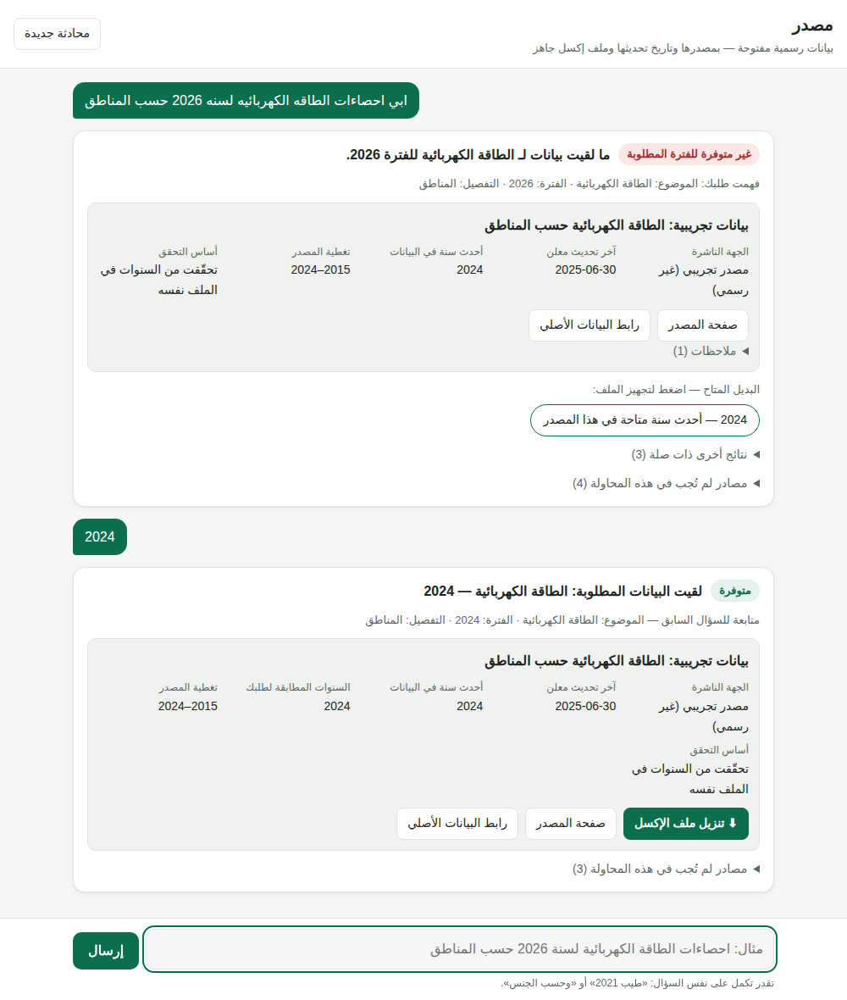

# مصدر (Masdar)

وكيل بحث في البيانات المفتوحة الرسمية السعودية بواجهة محادثة. تسأله بالعربية
الطبيعية، فيبحث في المصادر الرسمية ويعيد: **الملف جاهزاً بصيغة إكسل + الجهة
الناشرة + تاريخ آخر تحديث + رابط المصدر**. وإذا كانت السنة المطلوبة غير متوفرة،
يقولها صريحة ويقترح أحدث سنة موجودة — بضغطة تُجهّز ملفها.

```bash
pip install -e .
masdar serve --open        # واجهة الشات على http://127.0.0.1:8000
```

وفي المحادثة تكمل على نفس السؤال: «طيب 2022»، «وحسب الجنس»، «اعطني الأحدث».



ومن سطر الأوامر (المثال بالمصادر التجريبية، `--demo`):

```
$ masdar ask "ابي احصاءات الطاقه الكهربائيه لسنه 2026 حسب المناطق" --demo

❌ ما لقيت بيانات لـ الطاقة الكهربائية للفترة 2026.

بحثت ووجدت مجموعة البيانات، لكن السنة المطلوبة غير موجودة فيها:
📊 بيانات تجريبية: الطاقة الكهربائية حسب المناطق
   🏛 الجهة الناشرة: مصدر تجريبي (غير رسمي)
   📅 آخر تحديث معلن: 2025-06-30
   📚 تغطية المصدر: 2015–2024
   🔗 صفحة المصدر: …
   🔍 أساس التحقق: تم فتح الملف والتحقق من السنوات الموجودة فيه

ملاحظات:
   • سنة 2026 لم تنتهِ بعد؛ الإحصاءات السنوية الكاملة لها عادةً تُنشر بعد نهاية السنة.

🔄 البديل المتاح:
   • 2024 — أحدث سنة متاحة في هذا المصدر
```

## المبدأ الأساسي

> **لا يُقال شيء لا يمكن إثباته.**

وكيل بحث في البيانات الحكومية تكون قيمته في دقته، لا في طلاقته. لذلك بُني
النظام حول تصنيف صريح لقوة الدليل، وكل جواب مربوط بمستوى الدليل الذي يسنده:

| أساس التحقق | يُثبت التوفر؟ | يُثبت عدم التوفر؟ |
|---|---|---|
| `OBSERVED_DATA` — فُتح الملف وقُرئت السنوات من داخله | ✅ | ✅ |
| `METADATA_CLAIM` — تغطية معلنة في بيانات المصدر الوصفية | ✅ | فقط إذا كانت القائمة معلنة كاملة |
| `INFERRED_TITLE` — سنة مستنتجة من العنوان أو اسم الملف | ❌ | ❌ |

النتيجة أن الوكيل لا يستطيع بنيوياً أن يقول «متوفرة» لأن عنوان ملف ذكر سنة.
وإذا لم يجد دليلاً كافياً يقول «غير مؤكَّدة» بدل أن يخمّن.

### تمييز مهم: «غير متوفرة» ≠ «ما قدرت أوصل»

أسوأ ما يمكن أن يفعله هذا النظام هو أن يقول «لا توجد بيانات» بينما الحقيقة أن
الاتصال بالمصدر فشل. لذلك الحالتان منفصلتان في النموذج والرسالة:

- `NOT_AVAILABLE` — وصلنا للمصدر، وتأكدنا أن السنة غير موجودة فيه.
- `SOURCE_UNREACHABLE` — لم نصل للمصدر، ولا نحكم على التوفر إطلاقاً.

## التشغيل

```bash
pip install -e .

masdar serve                   # واجهة الشات (محلياً على 127.0.0.1:8000)
masdar serve --demo --offline  # جرّب الواجهة بمصادر تجريبية بدون إنترنت
masdar ask "احصاءات الطاقه الكهربائيه لسنه 2024 حسب المناطق"
masdar ask "…" --json          # مخرجات JSON للاستخدام البرمجي
masdar ask "…" --explain       # مع سجل البحث خطوة بخطوة
masdar ask "…" --demo          # مع مصادر تجريبية تعمل بدون إنترنت
masdar parse "…"               # اعرض كيف فُهم السؤال فقط
masdar sources                 # سجل المصادر
masdar doctor                  # افحص الوصول إلى كل مصدر فعلياً
```

### تجربة كاملة بدون إنترنت

```bash
masdar ask "الكهرباء 2026 حسب المناطق" --demo --max-sources 0   # ← غير متوفرة + بديل
masdar ask "الكهرباء 2024 حسب المناطق" --demo --max-sources 0   # ← متوفرة + ملف إكسل
```

المصادر التجريبية بيانات مُولّدة للاختبار، معزولة في ملف منفصل ولا تدخل أي
بحث عادي، وكل ملف إكسل يُنتج منها يحمل تحذيراً بأنها ليست بيانات رسمية.

### واجهة الشات

`masdar serve` يشغّل خادماً محلياً بلا أي مكتبة إضافية، ويفتح صفحة محادثة عربية:
لكل جواب بطاقة فيها الحكم (متوفرة / جزئياً / غير متوفرة / غير مؤكدة / تعذّر
الوصول)، والجهة الناشرة، وتاريخ آخر تحديث معلن، وأحدث سنة في البيانات، وزر
**تنزيل ملف الإكسل**، ورابط المصدر. والبدائل أزرار: الضغط على «2024 — أحدث سنة
متاحة» يسأل عنها ويجهّز ملفها.

- **المتابعة**: رسالة تغيّر السنة أو تضيف تفصيلاً فقط («طيب 2021»، «وحسب
  الجنس») تُكمل السؤال السابق. ورسالة فيها موضوع أو كلمات بحث جديدة سؤال جديد.
- **الأمان**: يعمل على `127.0.0.1` افتراضياً ولا يحتاج دخولاً لأنه على جهازك.
  لا يُنزَّل إلا ملف أنتجه الخادم نفسه، برمز يُعطى عند إنتاجه لا بمسار من الطلب.
  ونصوص المصادر تُعرض نصاً لا HTML، ولا يُعرض رابط إلا إن كان http(s).

### الفهم بالذكاء الاصطناعي (اختياري)

المحلل العربي يفهم ما في معجمه: «احصاءات الطاقة الكهربائية 2024 حسب المناطق».
أما «ودي اعرف كم كيلوات صرفته البيوت بكل منطقة» فلا يجد فيه موضوعاً. عندها — وعندها
فقط — يُسأل Claude أن يحوّل السؤال إلى الطلب نفسه: موضوع من القائمة، وسنوات،
وتفصيل، وعبارات بحث. ثم يكمل الوكيل كالمعتاد.

```bash
pip install -e '.[ai]'
# في ملف .env (لا يُرفع للمستودع):
ANTHROPIC_API_KEY=...
```

- **لا يجيب ولا يكتب أرقاماً**: دوره الفهم فقط. التوفر والسنوات والأرقام تأتي
  من المصادر وقواعد الدليل كما هي. ومخرجاته مقيّدة بمخطط JSON، ثم يُتحقق منها
  مجدداً: موضوع غير معروف أو سنة غير معقولة تُحذف.
- **لا يُستدعى إلا عند الحاجة**: سؤال يفهمه المحلل لا يغادر جهازك. وحين يُستدعى
  يُرسل نص السؤال إلى Anthropic.
- **فشله لا يُسقط الجواب**: بلا مفتاح، أو انقطاع، أو رد غير صالح — يعود لقراءة
  القواعد، ويُذكر السبب في سجل البحث.
- **يظهر في الواجهة**: «فهمت طلبك (بمساعدة الذكاء الاصطناعي)» مع جملة تعيد
  صياغة السؤال، فيظهر أي سوء فهم قبل الاعتماد على الملف.
- النموذج الافتراضي `claude-opus-5` بجهد تفكير منخفض (مهمة خفيفة)، ويُغيَّر بـ
  `MASDAR_LLM_MODEL`، ويُعطَّل بـ `MASDAR_LLM=off`. `masdar doctor` و`masdar serve`
  يطبعان حالته.

## هل يسحب البيانات الجديدة تلقائياً؟

نعم — وهذا سبب الاعتماد على الواجهات البرمجية (API) لا على ملفات منسوخة. الوكيل
**لا يخزّن البيانات**: عند كل سؤال يسأل المصدر نفسه أي السنوات موجودة الآن، وينزّل
الملف في لحظتها.

| ما يتغيّر عند المصدر | هل يراه الوكيل بلا تدخل؟ |
|---|---|
| سنة جديدة في مجموعة موجودة (واجهة الإحصاء cdata) | ✅ في السؤال التالي |
| ملف أو مجموعة جديدة لجهة مضافة في المنصة الوطنية | ✅ فهرس الجهة يُقرأ من المنصة عند كل سؤال |
| مجموعة جديدة في KAPSARC أو مؤشر جديد في قاعدة بيانات الإحصاء | ✅ بحث مباشر في فهرسيهما |
| واجهة (API) جديدة تطلقها الهيئة في بوابة المطوّرين | ⚠️ مرة واحدة: `masdar import-spec` لملفها، لأن الواجهة لا توفّر فهرساً |
| جهة جديدة في المنصة الوطنية | ⚠️ مرة واحدة: سطر بمعرّفها في `sources.yaml` |

**النسخة المحفوظة**: الردود تُحفظ مؤقتاً حتى لا يُعاد تنزيل الشيء نفسه لكل رسالة
في المحادثة، وتنتهي صلاحيتها بعد **6 ساعات** (`MASDAR_CACHE_MAX_AGE_HOURS`، و`0`
يعني اسأل المصدر دائماً). وقبل هذا الإصلاح كانت النسخة لا تنتهي أبداً — أي أن
سنة تُنشر بعد أول سؤال ما كانت لتظهر. وإذا استُخدمت نسخة محفوظة يذكر الجواب
تاريخ جلبها.

**والأحدث بين المصادر**: الجواب يُختار للأقرب لسؤالك، لكن إن فتح الوكيل ملفاً
آخر فيه سنة أحدث، يعرضها بديلاً باسم جهتها («2024 — أحدث سنة وجدتها في مصدر
آخر: وزارة الطاقة»). وسؤال «الأحدث» لا يتوقف عند أول مجموعة فيها بيانات.

## البنية

```
صفحة الشات (chat/static)  ←→  chat/server.py  (masdar serve)
      │
      ▼
 chat/session.py  المتابعة →  «طيب 2021» تُكمل السؤال السابق
      │
      ▼
 nlu/        فهم الطلب  →  DataRequest (موضوع، فترة، تفصيل)
      │                    يطبّع الأرقام العربية والهمزات، ويحوّل الهجري
      ▼
 sources/    البحث       →  DatasetCandidate[]  (محوّل لكل مصدر)
      │                    الفشل يُبلَّغ كفشل، لا كنتيجة فارغة
      ▼
 pipeline/   الترتيب     →  resolve.py  (نقاط + سبب مقروء لكل نقطة)
      │      التحقق      →  verify.py   (الحكم بحسب قوة الدليل)
      ▼
 export/     الإخراج     →  ملف إكسل + ورقة «المصدر» بالإسناد الكامل
      │
      ▼
 pipeline/reply.py       صياغة الجواب من الحكم، لا قبله
```

| الطبقة | المسؤولية |
|---|---|
| `masdar/domain/` | نموذج المجال: الأنواع التي تفرض قاعدة الإثبات |
| `masdar/nlu/` | تطبيع عربي، تحويل هجري، تحليل السؤال، وفهم اختياري بـ Claude |
| `masdar/sources/` | سجل المصادر + محوّل لكل مصدر + طبقة HTTP |
| `masdar/pipeline/` | الترتيب، التحقق، تنسيق الجواب |
| `masdar/export/` | قراءة الجداول المنشورة وكتابة الإكسل |
| `masdar/config/` | المصادر والمواضيع كبيانات، لا كود |
| `masdar/chat/` | جلسة المحادثة، والخادم المحلي، وصفحة الشات |

تفاصيل القرارات الهندسية في [`docs/ARCHITECTURE.md`](docs/ARCHITECTURE.md).

## التوسيع بدون كتابة كود

**إضافة موضوع أو مفردات** — `masdar/config/topics.yaml`:

```yaml
  - id: electricity
    label_ar: الطاقة الكهربائية
    keywords_ar: [كهرباء, استهلاك الكهرباء, الأحمال الكهربائية]
    preferred_sources: [wera, saudi_open_data, moenergy, gastat]
```

المطابقة تتم بعد التطبيع، فاكتب المفردات بالإملاء العادي. زيادة المفردات
تزيد الاستدعاء (recall) ولا تضر.

**إضافة مصدر** — `masdar/config/sources.yaml`:

```yaml
  - id: wera
    name_ar: هيئة تنظيم المياه والكهرباء
    base_url: https://wera.gov.sa
    adapter: html_index          # أو saudi_open_data
    authority: 95                # قربه من كونه منشئ الإحصاءة
    api_verified: false
    topics: [electricity, water, energy]
```

المحوّلات المتاحة: `saudi_open_data` (واجهة JSON)، `html_index` (صفحة نشرات
HTML)، `fixture` (ملفات محلية). محوّل جديد = صف واحد في
`masdar/sources/registry.py` وصنف يورث `SourceAdapter`.

## المصادر الرسمية: ما تم التحقق منه

فُحصت المصادر فعلياً بتاريخ 2026-09-27.

### ✅ واجهة مؤكَّدة وتعمل: قاعدة بيانات الهيئة العامة للإحصاء

`database.stats.gov.sa/gastatapi/portal/api/v1/` — **بلا مفتاح، بلا تسجيل**،
تم التحقق منها بطلب مباشر (HTTP 200، `application/json`):

| المسار | يُعيد |
|---|---|
| `indicators/cardsinfo` | `{"info": [...]}` — المؤشرات الرئيسية، بحقول `ar_title`/`en_title`/`obsvalue`/`frequency` |
| `indicators/public` | فهرس المؤشرات، نحو 2,600 مؤشر (~4.5MB) |
| `indicators/getDataForChart?api=<token>` | مشاهدات المؤشر بشكل OData: `{"value":[…]}` |

نقطتان غيّرتا التصميم:

- **لا بحث من جهة الخدمة** — جدار الحماية يرفض معاملات الاستعلام على الفهرس،
  فيُجلب الفهرس كاملاً مرة واحدة (مع تخزين مؤقت على القرص) ويُصفّى محلياً.
- **`frequency_en` تعني التكرار لا التغطية** — قيمتها «Annual» لا قائمة سنوات.
  لذلك لا يُدّعى شيء عن التغطية، وتُستخرج السنوات من المشاهدات نفسها، فيصبح
  الحكم `OBSERVED_DATA` أي قاطعاً.

أعمدة `getDataForChart` تُسمّى حسب المؤشر (`ELEC_TIME`، `ELEC_OBSV`)، فلا يمكن
إيجاد عمود السنة بالاسم — وكشف السنوات بالمحتوى الموجود أصلاً التقطه تلقائياً.

### ✅ الأفضل: واجهة cdata — `api.stats.gov.sa`

`GET https://api.stats.gov.sa/v1/stats/{dataset_id}` — مواصفة OpenAPI 3.0،
**والواجهات العامة لا تحتاج مفتاحاً**؛ تم التحقق بطلب مباشر (HTTP 200).

هذه أفضل مسار بيانات، لثلاثة أسباب:

- **التجميع في الخادم**: `dimensions[]=REGION&dimensions[]=YEAR` — فطلب «حسب
  المناطق» يُنفَّذ في المصدر لا بمعالجة لاحقة.
- **التغطية باستعلام رخيص**: `dimensions[]=YEAR` وحده يُعيد صفاً لكل سنة
  متاحة. فتُعرف السنوات بدليل من المصدر نفسه قبل تنزيل أي شيء.
- **أعمدة موسومة بدورها**: `YEAR_TIME` للفترة، `*_OBSV` للقيم،
  `*_ARAB`/`*_ENGL`/`*_CODE` للمسميات. وتدعم `format=CSV|JSON|HTML`
  و`$top`/`$skip`/`$orderby`.

> **تحذير مهم عن هذه الواجهة: تجمع القيم بصمت.** أي بُعد لا يُطلب تُجمع قيمه.
> طلب متوسط العمر المتوقع بالسنة وحدها أعاد لعام 2022 **234.09 سنة** — وهو
> مجموع الإناث (80.89) والإجمالي (77.90) والذكور (75.30). وجمع المعدلات لا
> معنى له، ولأن الأبعاد تحتوي صف «المجموع» بجانب أجزائه، فحتى جمع الأعداد يحسب
> مرتين. لذلك **يطلب النظام كل أبعاد المجموعة دائماً**، فتصل الأرقام كما نشرها
> المصدر ولا يُجمع أي شيء. ولأن ذلك يزيد الصفوف، تُجلب البيانات صفحة صفحة حتى
> صفحة فارغة، ويُرفض التصدير — بدل تسليم جزء على أنه كامل — إن تكررت صفوف بين
> الصفحات أو زادت الصفحات عن الحد.

**المجموعات المُضافة** (كلها مُتحقَّقة بطلب مباشر):

| المعرّف | المحتوى | الأبعاد |
|---|---|---|
| `DPV_HES_EHE_IT_HES0303` | **استهلاك** الكهرباء في المساكن بالكيلوواط | الفصل، المنطقة، السنة |
| `DPV_HES_EHE_IT_HES0301` | المساكن **المتصلة** بالكهرباء | شبكة الكهرباء، نوع المسكن، الحيازة، المنطقة، السنة |
| `DPV_HLTH13_DPHLTH1304` وأربع أخرى | متوسط العمر المتوقع، معدلات الوفيات والخصوبة | المؤشر، الجنس، العمر، الجنسية، السنة |

المجموعتان مختلفتان: الأولى كميات مستهلكة، والثانية عدد مساكن موصولة. سؤال عن
«الاستهلاك» يختار `HES0303`، وهو ما يطابق الطلب الأصلي.

**وبعد استيراد ملفات المواصفات الثلاثين من البوابة: 95 مجموعة** تُبحث محلياً
دون أي طلب شبكة، وتُطلب بياناتها عند الحاجة فقط:

| المجال | المجموعات | أمثلة |
|---|---|---|
| أهداف التنمية المستدامة (2–17) | 30 | وفيات الأمومة، التقزّم، الكهرباء، تكاليف التحويلات |
| إحصاءات الأعمال والمنشآت الصغيرة والمتوسطة | 14 | عدد المنشآت، الإيرادات والنفقات التشغيلية |
| السكان والصحة | 12 | متوسط العمر المتوقع، الوفيات، الخصوبة |
| الأسعار (العقار، الجملة، المستهلك) | 10 | التضخم الشهري، أسعار العقار الربعية |
| الحسابات القومية | 8 | الناتج المحلي حسب النشاط وطريقة الدخل وبنود الإنفاق، الدخل القومي |
| الطاقة (الكهرباء ووقود الأسر) | 6 | استهلاك الكهرباء حسب المنطقة والفصل، الطاقة الشمسية في المساكن |
| الإنتاج الصناعي | 5 | الرقم القياسي حسب النشاط |
| الحج والعمرة | 4 | الحجاج من الخارج والداخل، المعتمرون |
| البحث والتطوير | 3 | الإنفاق حسب القطاع، عدد الباحثين |
| الثقافة وأساليب الحياة | 3 | المكتبات المنزلية، قراءة الصحف |

`masdar specs` يعرضها كلها. جداول أهداف التنمية تُعيد صفوفها كما هي مهما طُلب
من أبعاد (تم التحقق: `DPV_SDG10_C_1`)، ومعها عشرات الأعمدة قيمتها
«لاينطبق» في كل صف؛ فتُحذف هذه الأعمدة من ملف الإكسل — لا تغيّر أي رقم —
وتُذكر أسماؤها في الملاحظات.

التغطية الحقيقية للمجموعتين عند الفحص:
**2017، 2018، 2019، 2021، 2022** — لا يوجد **2020**، ولا شيء بعد 2022. لذلك:

```
$ masdar ask "ابي احصاءات الطاقه الكهربائيه لسنه 2020 حسب المناطق"

❌ ما لقيت بيانات لـ الطاقة الكهربائية للفترة 2020.
   📚 تغطية المصدر: 2017–2022 (ناقصة: 2020)
   🔍 أساس التحقق: تم فتح الملف والتحقق من السنوات الموجودة فيه
🔄 البديل المتاح:
   • 2022 — أحدث سنة متاحة في هذا المصدر
   • 2019 — أقرب سنة متاحة قبل 2020
   • 2021 — أقرب سنة متاحة بعد 2020
```

لاحظ «(ناقصة: 2020)»: كتابة «2017–2022» وحدها تُقرأ كتسلسل غير منقطع، فالثغرات
تُسمّى صراحة.

### إضافة الواجهات: ملفات المواصفات هي الإعداد

لا يوجد في الواجهة مسار فهرس، فمعرفة المجموعات المتاحة تأتي من بوابة المطوّرين.
وبدل نقلها يدوياً — وهو بالضبط نوع الخطأ الصامت الذي وُجد المشروع لمنعه — تُقرأ
ملفات OpenAPI مباشرة:

1. في البوابة، افتح صفحة الواجهة ← قائمة الصفحة ← **تنزيل المواصفات** (JSON).
2. ارفع الملفات إلى مجلد `incoming/` في المستودع، ثم
   `masdar import-spec incoming/*.json`.
3. `masdar specs` — يعرض كل مجموعة: معرّفها، عنوانها، بُعدها الزمني، أبعادها،
   ومواضيعها المستنتجة من عنوانها.

كل مسار `/v1/stats/<id>` في الملف يصبح مجموعة قابلة للبحث: العنوان من
`summary`، الأبعاد من قائمة `dimensions[]`، البُعد الزمني من معاملات `*_TIME`،
والقياسات من حقول `*_OBSV` في مخطط الاستجابة. ويعمل الاستيراد مع المعاملات
المضمّنة ومع `$ref` معاً، لأنه لم يُتحقَّق أيهما تصدره البوابة.

ويحرس الاستيراد أمرين:

- **يرفض ملفاً يحتوي مفتاحاً**. بعض البوابات تضع مفتاح المستخدم في الأمثلة،
  والمواصفات تُرفع للمستودع.
- **لا يثق بعنوان خادم أجنبي**. حقل `servers` في المواصفة يحدد إلى أين تُرسل
  الطلبات — ومعها المفتاح — فلا يُقبل إلا على المضيف المُعدّ للمصدر.

والمجموعة المُعلنة يدوياً في `sources.yaml` تُدمج مع نظيرتها المستوردة بنفس
المعرّف: حقولها المنقّحة (العنوان، الكلمات) تتقدّم، والمواصفة تكمل ما تركته
(القياسات، التصنيفات). فلا تُمحى المراجعة اليدوية بإعادة الاستيراد، ولا تظهر
المجموعة مرتين.

**المفاتيح**: الواجهات العامة لا تحتاجها. إن احتاجت واجهة مفتاحاً، يُقرأ من
`GASTAT_API_KEY` في البيئة — انظر `.env.example`. **لا أسرار في المستودع**،
ويفشل اختبار إذا ظهر في ملفات الإعداد نص طويل يشبه مفتاحاً.

### ✅ منصة البيانات المفتوحة الوطنية — `open.data.gov.sa`

الواجهة موثّقة في [دليل المطورين](https://open.data.gov.sa/ar/pages/developers-api)
للمنصة، وتم التحقق منها بطلبات مباشرة (2026-09-28). التخمين السابق
`/data/api/v1/datasets` كان خاطئاً — ولهذا رفضه جدار الحماية.

| المسار | يُعيد |
|---|---|
| `/data/api/organizations?organization=<id>` | الجهة وكل مجموعاتها بعناوين **عربية** |
| `/data/api/datasets?dataset=<id>` | الناشر، **تاريخ آخر تحديث**، الفترة المعلنة، الوسوم |
| `/data/api/datasets/resources?dataset=<id>` | ملفات CSV وXLSX بروابط تنزيل مباشرة |

لا يوجد مسار عام يسرد الجهات ولا مسار بحث، فيُبنى الفهرس من قائمة جهات مُعدّة
في `sources.yaml`. الجهات المُعدّة حالياً **37 جهة** (نحو 4,860 مجموعة للـ28 التي حُسبت)
(كل معرّف تأكّد بطلب مباشر به؛ الأعداد تقريبية وقت الفحص):

| الجهة | المجموعات | تُسأل في مواضيع |
|---|---|---|
| وزارة العدل | 1,598 | العدل والقضاء، الإسكان |
| هيئة الزكاة والضريبة والجمارك | ~287 | التجارة، المالية، الأعمال |
| وزارة السياحة | 240 | السياحة |
| وزارة البيئة والمياه والزراعة | 183 | المياه، الزراعة، البيئة |
| وزارة الحج والعمرة | ~174 | السياحة (الحج والعمرة) |
| وزارة النقل والخدمات اللوجستية | ~158 | النقل |
| وزارة التعليم | 134 | التعليم، البحث |
| المؤسسة العامة للتأمينات الاجتماعية | ~131 | سوق العمل، المالية |
| وزارة الإعلام | ~128 | الثقافة، الاتصالات |
| وزارة الموارد البشرية والتنمية الاجتماعية | 122 | سوق العمل، السكان |
| وزارة الاقتصاد والتخطيط | ~114 | الناتج المحلي، السكان، العمل، الأسعار |
| وزارة التجارة | 113 | الأعمال، التجارة، الأسعار |
| الهيئة العامة للطيران المدني | ~108 | النقل، السياحة |
| وزارة الثقافة | ~107 | الثقافة |
| وزارة الطاقة | 100 | الكهرباء، الطاقة، البيئة |
| وزارة الصحة | 100 | الصحة، السكان |
| وزارة المالية | ~97 | المالية، الناتج المحلي |
| الهيئة العامة للإحصاء | 84 | كل المواضيع |
| وزارة الاتصالات وتقنية المعلومات | ~80 | الاتصالات |
| وزارة الرياضة | ~45 | الثقافة والرياضة |
| وزارة الاستثمار | ~40 | الأعمال، المالية |
| البنك المركزي السعودي | ~37 | المالية، الأسعار، الناتج المحلي |
| هيئة السوق المالية | ~214 | المالية، الأعمال |
| الهيئة العامة للعقار | ~200 | الإسكان، الأسعار |
| الهيئة العامة للموانئ | ~154 | النقل، التجارة |
| هيئة الاتصالات والفضاء والتقنية | ~77 | الاتصالات |
| المركز الوطني للأرصاد | ~20 | البيئة والطقس، المياه |
| وزارة الداخلية | 19 | كل المواضيع |
| الهيئة العامة للغذاء والدواء | — | الصحة، الأعمال |
| مجلس الضمان الصحي | — | الصحة، المالية |
| هيئة الهلال الأحمر السعودي | — | الصحة |
| الهيئة العامة للنقل | — | النقل |
| صندوق التنمية العقارية | — | الإسكان، المالية |
| هيئة تقويم التعليم والتدريب | — | التعليم |
| صندوق تنمية الموارد البشرية (هدف) | — | سوق العمل، التعليم |
| هيئة التأمين | — | المالية |
| الهيئة العامة للأوقاف | — | المالية |

مواضيع الجهات التسع الأخيرة من عناوين مجموعاتها الفعلية، لا من أسمائها.

عمود «تُسأل في مواضيع» يحدد متى تُفتح فهرسة الجهة: سؤال عن الكهرباء لا يطلب فهرس
وزارة العدل (1,598 عنواناً عن القضايا) — أسرع، وبلا نتائج دخيلة. والجهة بلا قائمة
مواضيع (الهيئة العامة للإحصاء) تُسأل دائماً، وكذلك كل الجهات لسؤال بلا موضوع.
والفهارس تُجلب بالتوازي.

**السنة في العنوان**: جهات كثيرة تنشر السلسلة الواحدة مجموعةً لكل سنة أو ربع
(«الأسماء التجارية المحجوزة لعام 2022 الربع الثالث»). ولا يُفتح إلا أول بضع نتائج،
فالعنوان الذي يذكر السنة المطلوبة يتقدّم، وعنوان سنة أخرى يتأخر دون أن يُحذف (قد
يكون أحدث سنة موجودة). ولسؤال «الأحدث» يتقدّم الأحدث سنةً ثم ربعاً.

**سدايا**: المنصة نفسها تديرها الهيئة السعودية للبيانات والذكاء الاصطناعي، فالبحث
فيها هو البحث في «سدايا». أما صفحة سدايا كجهة ناشرة فلم تُضف: اسمها الكامل يرفضه
جدار الحماية، و«سدايا» ليس اسماً مسجلاً.

ومنها ما طُلب في السؤال الأول حرفياً: «استهلاك مناطق المملكة من الكهرباء حسب
المناطق التشغيلية».

**المعرّف والاسم معاً**: كل جهة مُعدّة بمعرّفها واسمها العربي الدقيق، والواجهة تقبل
أيهما. يُطلب بالمعرّف أولاً (يصمد أمام تغيير الاسم)، فإن رُدّ بـ«غير موجود» يُطلب
بالاسم (يصمد أمام معرّف أُعيد إصداره أو نُسخ خطأ). وجهة بالاسم وحده تكفي.

**اكتشاف كل الجهات — من جهازك**:

```bash
masdar publishers                 # قائمة المنصة كاملة (من داخل المملكة)
masdar publishers --names names.txt   # أو أسماء عربية دقيقة، اسم في كل سطر
```

الأمر يسرد جهات المنصة، ويترك المُعدّة منها، ثم يفتح فهرس كل جهة جديدة ويصنّف
مواضيعها **من عناوين مجموعاتها** (موضوع يحمله 15% من العناوين على الأقل)، ويكتب
`masdar/config/publishers_discovered.yaml` للمراجعة. المحوّل يقرأ الملف مع
`sources.yaml` (والمُعدّ يتقدّم عند التعارض). وجهة لم يناسب عناوينها موضوع
تُسأل فقط في الأسئلة التي بلا موضوع.

- مسار القائمة (`/api/publishers`) هو ما تستخدمه صفحة الجهات في المنصة، وحقوله
  (`publisherID`، `nameAr`، `numberOfDatasets`) مأخوذة من كود الصفحة نفسها.
  **لم يُختبر حياً**: لا يُجيب من خارج المملكة. إن فشل يقول الأمر ذلك ويقترح
  `--names`، الذي يمر بالمسار الموثّق المُتحقَّق منه.
- لا يُعتمد على قِصر الصفحة لإنهاء القائمة (قد يحدّ الخادم حجم الصفحة): ينتهي
  بوسم الخادم «آخر صفحة» أو بصفحة فارغة أو بصفحة لا تضيف جديداً.

لم يُعثر بالاسم على: «وزارة الصناعة والثروة المعدنية»، «وزارة البلديات والإسكان»،
«الهيئة العامة للمنشآت الصغيرة والمتوسطة»، «هيئة الحكومة الرقمية». ورفض جدار
الحماية من خارج المملكة أسماء «الهيئة السعودية للبيانات والذكاء الاصطناعي»
و«وزارة الشؤون الإسلامية والدعوة والإرشاد» و«المؤسسة العامة للتدريب التقني
والمهني» — ويجرّبها `masdar publishers` من جهازك.

الفترة المعلنة (`timePeriod`) ادعاء لا دليل، فالنظام يفتح الملف ويقرأ السنوات
منه. وإن تعذّر فتح ملف (XLSX تالف مثلاً) يُجرَّب الملف التالي (CSV)، ويُسند الجواب
للملف الذي قُرئ فعلاً — ببصمته هو.

**صفحة «واجهات البيانات اللحظية»** (`/ar/pages/real-time-api`) دليل روابط لا
بيانات: 19 خدمة لجهات مختلفة، فُحصت كلها (2026-09-28):

- **نحو نصفها خدمات تحقق لسجل واحد** — واثق (السجل التجاري)، العنوان الوطني،
  قوائم (القوائم المالية) وأمثالها: تُسأل عن منشأة أو عنوان بعينه، وتحتاج
  اشتراكاً، ولا تُعيد إحصاءات. خارج نطاق مصدر عمداً.
- **رابط البنك المركزي** في الصفحة يُعيد 404.
- **أُضيفت بعد التحقق**: البيانات اللحظية لوزارة الموارد البشرية (ثلاثة ملفات)،
  وعدّادات وزارة البيئة والمياه والزراعة (ثلاثة من خمسة) — انظر «البيانات اللحظية».
- **لم تُضف**: مجلس الضمان الصحي يعرض رسوماً بأرقام مقرّبة («4.65 مليون») بلا ملف
  بيانات (وأُضيف كجهة في المنصة الوطنية بدلاً من ذلك)؛ ومركز بيانات KAPSARC لا يستجيب.

### ✅ البيانات اللحظية — الموارد البشرية والبيئة والمياه والزراعة

| المصدر | المؤشرات |
|---|---|
| وزارة الموارد البشرية | مؤشرات قطاع العمل (إجمالي العمالة، السعوديون وغيرهم حسب الجنس)؛ مؤشرات التنمية الاجتماعية؛ توزيع القوى العاملة في القطاع العام حسب المنطقة والجنس والعمر |
| وزارة البيئة والمياه والزراعة | عدد الإبل؛ خلايا النحل؛ رخص الصيد |

الرقم اللحظي **لقطة**، لا إحصاء سنوي:

- كل صف يُختم بتاريخ الاستخراج، والتغطية سنة الاستخراج وحدها. سؤال عن سنة سابقة
  يُجاب «غير متوفرة هنا» ويُقترح المصدر السنوي.
- كل جواب يقول إنه ليس إحصاءً سنوياً مكتملاً.
- البصمة المذكورة بصمة ما أرسله المصدر نفسه، قبل إضافة عمود التاريخ.
- عدّادا الآبار والمزارع في دليل الوزارة لا يُرجعان قيمة حالياً، فلم يُضافا. والرد
  الفعلي يحمل القيمة في `Data` لا `Count` كما في الدليل.

### ✅ البنك الدولي — مؤشرات التنمية العالمية (مصدر دولي)

`api.worldbank.org` مفتوح بلا مفتاح، وتم التحقق منه بطلبات مباشرة. أُضيف لأنه
موثوق وطويل المدى (من 1960)، ويسدّ فجوات مثل استهلاك الكهرباء للفرد ومعدل
الخصوبة والعمر المتوقع — لكنه **مصدر دولي لا الجهة المنتجة**:

- **يأتي بعد الجهة السعودية دائماً**: عند تساوي الحكم يُقدَّم ملف الجهة
  السعودية، وفي الترتيب يُخصم منه. ولا يتقدّم إلا إذا كان وحده عنده السنة المطلوبة.
- **كل جواب يقول إنه دولي** ويذكر الجهة التي أخذ البنك الأرقام منها، واسم المؤشر
  بالإنجليزية ورمزه — لأن بعض الترجمات العربية لدى البنك خاطئة (`IT.NET.SECR.P6`
  خوادم إنترنت آمنة، واسمه العربي «مستخدمو الإنترنت»).
- **القيمة الفارغة ليست قيمة**: البنك يدرج سنوات بلا رقم (`null`) — استهلاك
  الكهرباء للفرد 2024 و2025 مثلاً — فتُستبعد ولا تُعد متوفرة.
- **الفهرس محلي والقيم حية**: 1,037 مؤشراً فيها قيمة للمملكة بين 2019 و2024،
  بأسماء البنك العربية والإنجليزية (`config/worldbank/wdi_sau.json`). القيم تُجلب
  وقت السؤال، وتاريخ التحديث يُقرأ من `lastupdated` في الرد. `masdar
  worldbank-catalogue` يعيد بناء الفهرس.
- **يختار أبسط مؤشر يطابق السؤال**: كلمات الاسم الأساسي تُحسب كاملة، وكلمات ما بين
  القوسين نصفاً («التجارة (% من الناتج المحلي)» ليست الناتج المحلي)، وكل كلمة
  زائدة تُخصم — فـ«عدد السكان» يجد «تعداد السكان، الإجمالي» لا «الإناث».

### ✅ KAPSARC — فهرس بحث حقيقي وتاريخ تحديث معلن

`datasource.kapsarc.org` (مركز الملك عبدالله للدراسات والبحوث البترولية) منصة
Opendatasoft، بلا مفتاح، تم التحقق منها بطلبات مباشرة. وفيها ما ينقص واجهة
الإحصاء:

- **فهرس بحث**: `where="electricity consumption"` أعاد 75 مجموعة.
- **تاريخ آخر تحديث حقيقي** (`modified`) لكل مجموعة — وهو ما طُلب من البداية.
- **الجهة الناشرة الأصلية**: KAPSARC تعيد نشر بيانات الهيئة والبنك المركزي
  والوزارات، فيُنسب الرقم لمصدره ويُذكر أنه «عبر KAPSARC».
- **تغطية من البيانات**: `group_by=year(year)` يُعيد السنوات الموجودة. مجموعة
  مشتركي الكهرباء يقول وصفها «2005-2022» وبياناتها فعلياً حتى **2025** — والنظام
  يعتمد البيانات لا الوصف.
- **تصدير كامل** بصيغة JSON، ويُقارن عدد الصفوف بـ `total_count`، ويُرفض
  التصدير الناقص بدل تسليمه.

العناوين إنجليزية حتى في حقول `_ar`، فيُبحث بالكلمات الإنجليزية للموضوع مع
كلمات السؤال.

### العقبات في المصادر الأخرى

| المصدر | يُستجيب؟ | العقبة |
|---|---|---|
| `api.stats.gov.sa` (cdata) | ✅ مؤكَّد ويعمل، بلا مفتاح | — |
| `database.stats.gov.sa` | ✅ مؤكَّد ويعمل | — |
| `datasource.kapsarc.org` | ✅ مؤكَّد ويعمل، بلا مفتاح | عناوين إنجليزية فقط |
| `api.worldbank.org` | ✅ مؤكَّد ويعمل، بلا مفتاح | مصدر دولي: يأتي بعد الجهة السعودية |
| `www.stats.gov.sa` | ✅ HTML حقيقي | Liferay، صفوف النتائج تحتاج معامل بورتلت |
| `open.data.gov.sa` | ✅ مؤكَّد ويعمل، بلا مفتاح | مقيَّد جغرافياً؛ لا يوجد بحث (فهرس من قائمة جهات) |
| بقية النطاقات | لم تُفحص | محجوبة عن بيئة البناء بسياسة الشبكة |

**1. التقييد الجغرافي.** كل محاولات الوصول إلى `open.data.gov.sa` من منافذ غير
سعودية فشلت، ونفس الرابط أعاد HTTP 200 من منفذ سعودي. فمن **داخل السعودية**
يعمل النظام مباشرة بلا إعداد. ومن خارجها:

```bash
export MASDAR_HTTP_BACKEND=firecrawl      # منفذ سعودي + متصفح حقيقي
export FIRECRAWL_API_KEY=...
```

**2. جدار الحماية يردّ بحالة 200.** `open.data.gov.sa` يعيد صفحة
`Request Rejected` مع رقم دعم — **بحالة HTTP 200**. لو عُوملت كصفحة عادية
لقُرئت كقائمة فارغة، أي «لا توجد بيانات» بينما الطلب رُفض. لذلك تُكتشف صراحة
وتُرفع كـ `SourceRejected`، ولا يُعاد المحاولة عليها.

**3. تطبيق صفحة واحدة.** البوابة الوطنية تطبيق Angular وبياناتها عبر XHR، فقراءة
HTML تعطي هيكلاً فارغاً. لذلك يرفض `html_index` مصدراً `rendering: spa` عبر HTTP
عادي ويشرح البديل، ويسمح به عبر منفذ يُنفّذ جافاسكربت.

**4. GASTAT (الموقع).** بوابة Liferay تُرجع HTML حقيقياً: جداول البيانات 4113،
النشرات 1418، APIs 60، والسنوات **2016–2025** — تأكيد واقعي أن 2026 غير منشورة.

`masdar doctor` يميّز «تعذّر الوصول» من «رُفض من جدار الحماية» من «خطأ في
المسار»، ويطبع لكل حالة ما يجب عمله.

## الحالة الحالية

**جاهز ومختبَر** (352 اختباراً، كلها تعمل بدون شبكة):

- فهم السؤال بالعربية: الأرقام العربية (٢٠٢٦)، التشكيل، الهمزات، التاء
  المربوطة، النطاقات (`من 2019 إلى 2022`، `2023-2024`)، التقويم الهجري
  (`1447هـ` ← 2025/2026)، «أحدث بيانات…»
- قراءة الجداول المنشورة: تخطيط طولي وعرضي (السنوات كأعمدة)، صفوف عناوين
  فوق الترويسة، BOM، فواصل مختلفة، تحويل الأرقام لأرقام حقيقية
- منطق الأحكام الستة كاملاً مع اقتراح أقرب سنة متاحة
- إخراج إكسل مع ورقة إسناد (المصدر، تاريخ التحديث، وقت الاستخراج،
  بصمة SHA-256، الترخيص)
- طبقة جلب قابلة للاستبدال (مباشر / Firecrawl بمنفذ سعودي)، وكشف صفحات
  جدار الحماية، وتمييز الرفض الدائم من الفشل المؤقت

- محوّلان مؤكَّدان للهيئة العامة للإحصاء (cdata بـ 95 مجموعة من 30 واجهة،
  وقاعدة البيانات)، وقارئ JSON/OData، ووصف تغطية يُسمّي الثغرات
- منصة البيانات المفتوحة الوطنية وKAPSARC

- واجهة شات عربية (`masdar serve`) بجلسة تفهم المتابعة، وتنزيل الإكسل من الصفحة
- صلاحية محدودة للنسخ المحفوظة، ومقارنة الأحدث بين المصادر، ومصدر متعطّل يُبلَّغ
  كـ«تعذّر الوصول» ولا يُضيّع على المصادر العاملة فرصتها

- فهم اختياري بالذكاء الاصطناعي (Claude) للأسئلة التي لا يلتقطها المحلل
- 37 جهة في المنصة الوطنية، وأمر `masdar publishers` لاكتشاف البقية، وموضوع العدل والقضاء
- بيانات لحظية من الموارد البشرية والبيئة والمياه والزراعة
- ترتيب يقرأ السنة والربع من عنوان المجموعة
- البنك الدولي (1,037 مؤشراً للمملكة) كمصدر دولي يأتي بعد الجهات السعودية

**الخطوة التالية**: التحقق من المصادر المرشّحة أعلاه، وإيجاد الصيغة الدقيقة
لأسماء جهات لم تُعثر بعد (الصناعة، البلديات، منشآت)، ودمج الملفات الربعية لسنة
واحدة في ملف واحد.

**ملاحظة على المفاتيح**: بعض المسارات تتطلب مفتاحاً فعلاً — `HES0302` ردّ
`401: Failed to resolve API Key variable request.header.apikey`. الترويسة
اسمها `apikey`، وتُقرأ من `GASTAT_API_KEY` في ملف `.env` على جهازك، وتُرسل مع
كل طلب لهذا المصدر: فحص التغطية وتنزيل البيانات معاً. **ولا تُرسل أبداً عبر
Firecrawl** — المنفذ يرفض طلباً يحمل مفتاحاً بدل أن يسلّمه لطرف ثالث. ومثل
رفض 401 يُبلَّغ كـ«يحتاج مفتاحاً» لا كـ«لا توجد بيانات».

## الاختبارات

```bash
python -m pytest -q
```

الاختبارات تشتغل بـ `offline=True`، أي أن نجاحها دليل على أنها لم تلمس
الشبكة: كل البيانات تأتي من الملفات التجريبية عبر `file://` — نفس المسار
الذي يمر به أي ملف حقيقي.
